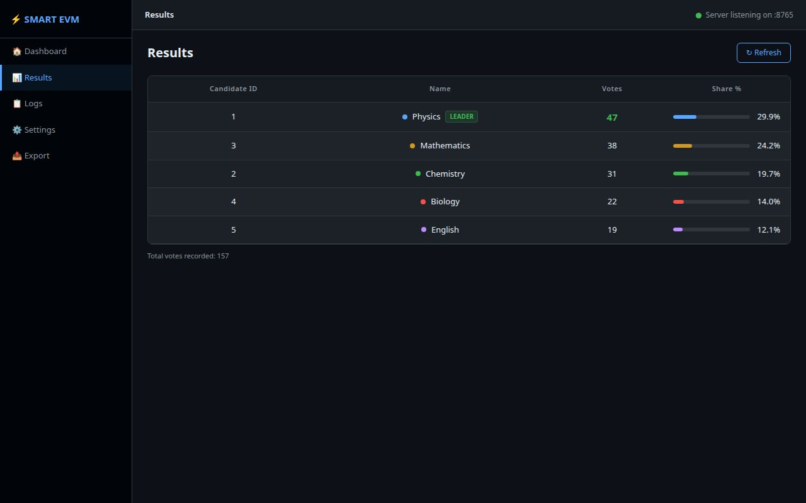
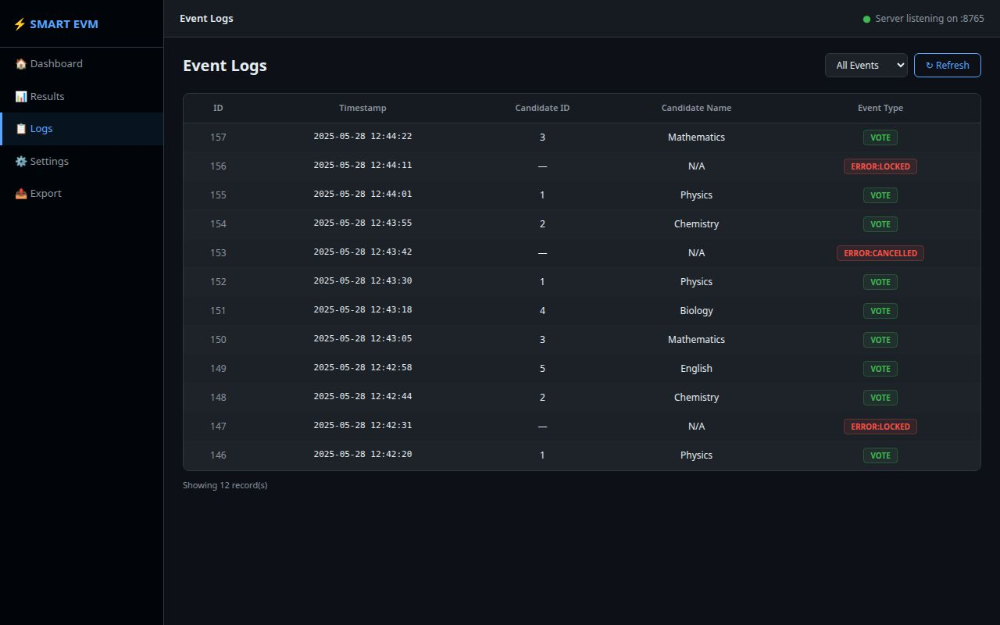
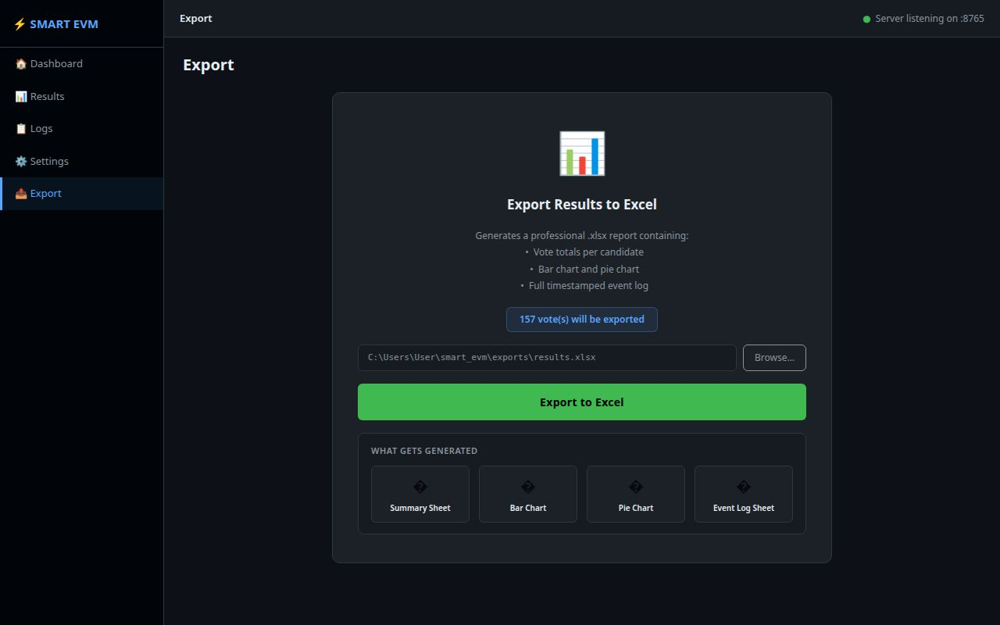

# ⚡ SMART EVM — Smart Electronic Voting Machine

A complete electronic voting system built with an **ESP8266 microcontroller** and a **Windows desktop application**. Voters hold a finger on a touch sensor for 5 seconds to cast their vote. The desktop app receives every vote instantly over Wi-Fi, counts it, updates live charts, and can export the full results to an Excel file.

---

## ✅ ESP8266 Code Compatibility

**The ESP8266 firmware in this repo is 100% compatible with the desktop app.** Here is a quick proof:

| What the ESP8266 sends | What the app expects | Status |
|---|---|---|
| `{"type":"vote","candidate_id":3}` | Exactly this format | ✅ |
| `{"type":"error","reason":"locked"}` | Exactly this format | ✅ |
| `{"type":"error","reason":"cancelled"}` | Exactly this format | ✅ |
| Connects to **port 8765** | Server listens on **port 8765** | ✅ |
| Connects to IP **192.168.4.2** | PC receives this IP from ESP hotspot | ✅ |

> When your PC connects to the ESP's Wi-Fi hotspot (`SMART_EVM`), Windows automatically assigns your PC the IP `192.168.4.2`. The firmware already targets this address — nothing needs to change.

---

## 📋 Table of Contents

1. [What You Need](#what-you-need)
2. [How the System Works](#how-the-system-works)
3. [Part 1 — Upload Firmware to ESP8266](#part-1--upload-firmware-to-esp8266)
4. [Part 2 — Install the Desktop App](#part-2--install-the-desktop-app)
5. [Part 3 — Run Your First Election](#part-3--run-your-first-election)
6. [App Pages — Full Guide](#app-pages--full-guide)
7. [Wiring Guide](#wiring-guide)
8. [Troubleshooting](#troubleshooting)
9. [Project File Structure](#project-file-structure)

---

## What You Need

### Hardware
- NodeMCU ESP8266 (any variant)
- 5 × TTP223 capacitive touch sensor modules
- 1 × I2C LCD display (16×2, address `0x27`)
- 1 × Green LED + resistor
- 1 × Red LED + resistor
- 1 × Blue LED + resistor
- 1 × Active buzzer
- Jumper wires, breadboard, USB-A to Micro-USB cable

### Software (on your Windows PC)
- **Python 3.11 or newer** — [python.org/downloads](https://www.python.org/downloads/)
  > ⚠️ During installation, **check the box "Add Python to PATH"** before clicking Install
- **Arduino IDE 2.x** — [arduino.cc/en/software](https://www.arduino.cc/en/software)

---

## How the System Works

```
  Voter holds finger on sensor (5 seconds)
               │
               ▼
     ESP8266 confirms the touch
               │
               ▼
     Sends vote over Wi-Fi ──────────────► Desktop App on PC
               │                                   │
               ▼                                   ▼
     LCD: "VOTE ACCEPTED"              Saves vote to database
     Buzzer beeps twice                Updates live charts
     10-second lockout starts          Shows in event log
```

- The **ESP8266** handles only the physical side: sensors, LCD screen, LEDs, and buzzer
- The **PC app** handles everything else: counting, storing data, live charts, results table, Excel export
- They communicate in real time using **WebSocket** over a direct Wi-Fi link (no internet needed)

---

## Part 1 — Upload Firmware to ESP8266

### Step 1 — Install Arduino IDE

Download and install Arduino IDE from [arduino.cc/en/software](https://www.arduino.cc/en/software). The default installer settings are fine.

### Step 2 — Add ESP8266 board support

1. Open Arduino IDE
2. Go to **File → Preferences**
3. Find the field labelled **"Additional boards manager URLs"** and paste:
   ```
   https://arduino.esp8266.com/stable/package_esp8266com_index.json
   ```
4. Click **OK**
5. Go to **Tools → Board → Boards Manager**
6. Search for `esp8266`
7. Click **Install** next to **"ESP8266 by ESP8266 Community"**
8. Wait for it to finish (may take a few minutes)

### Step 3 — Install required libraries

Go to **Tools → Manage Libraries**, search for each library below, and click **Install**:

| Search for | Install this |
|---|---|
| `WebSockets` | **WebSockets** by Markus Sattler |
| `ArduinoJson` | **ArduinoJson** by Benoit Blanchon |
| `LiquidCrystal I2C` | **LiquidCrystal I2C** by Frank de Brabander |

> `ESP8266WiFi` is already included with the ESP8266 board package — you do not need to install it.

### Step 4 — Upload the sketch

1. Open `smart_evm_esp8266.ino` in Arduino IDE
2. Connect the ESP8266 to your PC via USB
3. Go to **Tools → Board** → select **NodeMCU 1.0 (ESP-12E Module)**
4. Go to **Tools → Port** → select the COM port that appeared (e.g. `COM3` or `COM4`)
5. Click the **Upload** button (the arrow icon ➔)
6. Wait for **"Done uploading"** at the bottom of the screen

### Step 5 — Confirm it is working

1. Go to **Tools → Serial Monitor**
2. Set baud rate to **115200** (bottom-right dropdown)
3. You should see:
   ```
   SoftAP Started
   ESP IP: 192.168.4.1
   ```
4. The LCD on your hardware should now show:
   ```
   READY TO VOTE
   Hold 5 Seconds
   ```
   The **green LED** should be on.

---

## Part 2 — Install the Desktop App

### Step 1 — Get the files

Download and extract this repository. You will find a folder called `smart_evm` containing the desktop app.

> On Windows, you can extract `.zip` files by right-clicking → **Extract All**. For `.tar.gz`, use [7-Zip](https://www.7-zip.org/) (free) → right-click → **7-Zip → Extract Here**.

### Step 2 — Install Python

1. Go to [python.org/downloads](https://www.python.org/downloads/)
2. Download the latest **Python 3.11+** installer
3. Run the installer
4. On the **first screen**, tick **"Add Python to PATH"** — this is required
5. Click **Install Now**

### Step 3 — First-time setup with SETUP.bat

Before launching the app for the first time, run **SETUP.bat**:

1. Open the `smart_evm` folder
2. **Double-click `SETUP.bat`**

A blue terminal window will open and automatically:
- Check that Python is installed correctly
- Create a self-contained virtual environment (`.venv` folder)
- Download and install all required Python packages (PyQt6, websockets, openpyxl, matplotlib)

This process takes **1–3 minutes** depending on your internet speed. When it is done, you will see:

```
==========================================
  Setup complete!  Run START.bat to launch.
==========================================
```

Press any key to close the window.

> **When to run SETUP.bat again:**
> - If you move the `smart_evm` folder to a different location
> - If the app stops launching after a Windows update
> - If you get import errors or "module not found" messages
> - Any time you want a completely clean reinstall of the packages

### Step 4 — Launch with START.bat

After setup is complete:

1. **Double-click `START.bat`** inside the `smart_evm` folder
2. A green terminal window opens briefly, activates the environment, then launches the app

**You will use `START.bat` every time you want to open the app.** You do not need to run `SETUP.bat` again unless something breaks.

---

## Part 3 — Run Your First Election

Follow these steps **in this exact order** each time:

### 1. Power on the ESP8266
Connect it to USB power (PC or phone charger). Wait for the LCD to show `READY TO VOTE` and the green LED to turn on.

### 2. Connect your PC to the ESP8266 Wi-Fi

1. Click the Wi-Fi icon in the Windows taskbar
2. Find and click the network named **`SMART_EVM`**
3. Click **Connect**
4. Enter password: **`12345678`**

> ⚠️ Windows will show a warning like "No internet access" — this is completely normal. The ESP8266 creates a local network just for the voting machine. There is no internet connection on this network.

### 3. Launch the app

Double-click **`START.bat`**. The app opens in a few seconds.

### 4. Confirm the connection

Look at the **top-right corner** of the app window. Within a few seconds, it will change from:

```
● Server starting...
```
to:
```
● ESP connected  192.168.4.2:60412
```

The green dot confirms the ESP8266 and the PC app are communicating. You are ready.

### 5. Cast a vote

A voter places their finger on one of the 5 touch sensors and **holds it for 5 full seconds**:

| What happens | What it means |
|---|---|
| Blue LED turns on, LCD shows countdown | Touch is being verified |
| Buzzer beeps twice, LCD shows "VOTE ACCEPTED" | Vote was recorded successfully |
| Red LED turns on, LCD shows "PLEASE WAIT X Seconds" | 10-second lockout (prevents double voting) |
| Green LED turns back on | Machine is ready for the next voter |

Every accepted vote appears instantly on the Dashboard of the PC app.

### 6. End the session

When voting is finished:
- Go to the **Export** tab to save results to an Excel file
- Close the app normally
- To start a new election, go to **Settings → Clear All Data**

---

## App Pages — Full Guide

### 🏠 Dashboard

The main screen. Everything updates automatically in real time as votes arrive.


**What you see:**

- **5 vote counter cards** at the top — one per candidate, showing their live vote total
- **Bar chart** — compares all candidates side by side
- **Pie chart** — shows each candidate's percentage share of total votes
- **Live Events feed** (right side) — every vote and error is logged here with a timestamp as it happens
- **Total Votes** counter in the top-right corner

---

### 📊 Results

A ranked table of all candidates, sorted from highest to lowest votes.



**What you see:**

- Each candidate with their ID, name, vote count, and percentage
- A coloured progress bar showing their vote share visually
- The leading candidate is highlighted with a green **LEADER** badge
- Click **Refresh** to manually reload (the Dashboard auto-refreshes every 5 seconds)

---

### 📋 Logs

A complete record of every single event that has ever happened in this session.



**What you see:**

- Every accepted vote shown with a green **VOTE** badge
- Every rejected attempt shown with a red error badge
- Exact date and time (timestamp) for every event
- Use the dropdown filter to show: **All Events**, **Votes Only**, or **Errors Only**

**Understanding the error types:**

| Error shown | What happened |
|---|---|
| `ERROR:LOCKED` | Someone touched a sensor during the 10-second lockout after a vote |
| `ERROR:CANCELLED` | A voter lifted their finger before the 5 seconds completed |

---

### ⚙️ Settings

Configure the system before each election.


**Candidate Names**

The ESP8266 hardware only knows button numbers (1 through 5). This section lets you give each button a real name. For example, you can change "Physics" to "Alice Johnson". Click **Save Names** after making changes.

> Changes take effect immediately — you do not need to restart the app or re-upload the ESP8266 firmware.

**Network Configuration**

Displays the connection settings for reference. These should match the values in the ESP8266 firmware. You only need to change these if you modified the firmware.

| Setting | Value |
|---|---|
| WebSocket Port | 8765 |
| ESP8266 Wi-Fi name | SMART_EVM |
| ESP8266 Wi-Fi password | 12345678 |
| ESP8266 IP address | 192.168.4.1 |

**Danger Zone — Clear All Data**

Deletes every vote record from the database and resets all counters to zero. Use this at the start of each new election. The app will ask you to confirm before deleting anything.

---

### 📤 Export

Save the complete election results to an Excel spreadsheet (.xlsx).



**What the Excel file contains:**

| Sheet | Contents |
|---|---|
| Summary Sheet | Vote totals for every candidate |
| Bar Chart | Automatically generated chart comparing candidates |
| Pie Chart | Percentage distribution chart |
| Event Log Sheet | Every vote with its exact date and timestamp |

**How to export:**

1. Click **Export** in the left sidebar
2. The file path box shows where the file will be saved (default: `exports/results.xlsx` inside the app folder)
3. Click **Browse…** to choose a different save location if needed
4. Click the green **Export to Excel** button
5. A confirmation message appears when the file is ready
6. Open the file in Microsoft Excel or Google Sheets

---

## Wiring Guide

### Touch Sensors (TTP223) → ESP8266

| Touch Button | ESP8266 Pin | Candidate slot |
|---|---|---|
| Button 1 | D3 | Candidate 1 |
| Button 2 | D4 | Candidate 2 |
| Button 3 | D5 | Candidate 3 |
| Button 4 | D6 | Candidate 4 |
| Button 5 | D7 | Candidate 5 |

Each TTP223 sensor: **VCC → 3.3V**, **GND → GND**, **OUT → pin above**

### LEDs → ESP8266

| LED colour | ESP8266 Pin | When it is on |
|---|---|---|
| Green | D0 | Idle — ready for a vote |
| Blue | 03 RX | Verifying a touch (countdown in progress) |
| Red | 01 TX | Lockout — machine waiting between votes |

### Other Components

| Component | ESP8266 Pin |
|---|---|
| LCD SDA | D2 |
| LCD SCL | D1 |
| Buzzer | D8 |

LCD power: **VCC → 5V**, **GND → GND**

> **Power tip:** Solder a **470µF capacitor** between 5V and GND near the ESP8266. The Wi-Fi radio draws a large burst of current when it first connects, which can cause the ESP8266 to reset without this capacitor.

---

## Troubleshooting

### The app opens but never shows "ESP connected"

- Make sure your PC Wi-Fi is connected to `SMART_EVM`
- Make sure the ESP8266 is powered on (LCD shows `READY TO VOTE`)
- If Windows Firewall asks whether to allow Python — click **Allow** (for both private and public networks)
- Try closing and reopening the app

### Votes are not appearing on the dashboard

Open the Arduino Serial Monitor (baud: 115200). When a voter touches a sensor, you should see lines like:
```
{"type":"vote","candidate_id":3}
```
If you see `WebSocket Disconnected` instead, your PC may have received a different IP address. Open Command Prompt and type:
```
ipconfig
```
Look for the IP address under the `SMART_EVM` Wi-Fi adapter. If it is not `192.168.4.2` (e.g. it shows `192.168.4.3`), open the `.ino` file, find this line and update the IP:
```cpp
IPAddress serverIP(192, 168, 4, 2);
```
Then re-upload the firmware.

### Touch sensor triggers without being touched / inverts

Your TTP223 module may have the opposite signal logic. In the firmware, find:
```cpp
bool touched = digitalRead(TOUCH_PINS[i]);
```
Change it to:
```cpp
bool touched = !digitalRead(TOUCH_PINS[i]);
```

### START.bat shows "Python not found"

Python is either not installed or was installed without the PATH option. Uninstall Python via Windows Settings, then reinstall from [python.org](https://www.python.org/downloads/) and tick **"Add Python to PATH"** on the first screen.

### START.bat / SETUP.bat closes immediately with an error

1. Right-click the `.bat` file → **Run as administrator**
2. If it still fails, open Command Prompt, navigate to the `smart_evm` folder, and run:
   ```
   python main.py
   ```
   This keeps the window open so you can read the full error message.

### App shows an import error even after running SETUP.bat

Run `SETUP.bat` again — it will remove the broken environment and rebuild it from scratch. Make sure you have an internet connection when you run it.

---

## Project File Structure

```
smart_evm/
│
├── START.bat              ← Launch the app (use this every time)
├── SETUP.bat              ← First-time install / repair broken install
├── requirements.txt       ← List of Python packages
│
├── main.py                ← Entry point — starts the app
├── websocket_server.py    ← Receives votes from ESP8266 over Wi-Fi
├── database.py            ← Saves and reads votes (SQLite)
├── excel_export.py        ← Generates the Excel report
├── charts.py              ← Live bar and pie chart widgets
├── config.py              ← All settings in one place
├── logger.py              ← Event logging
│
├── ui/
│   ├── dashboard.py       ← Dashboard page
│   ├── results_page.py    ← Results table page
│   ├── logs_page.py       ← Event log viewer page
│   ├── settings_page.py   ← Settings page
│   └── export_page.py     ← Export page
│
├── database/
│   └── evm.db             ← Vote database (auto-created on first run)
│
├── exports/
│   └── results.xlsx       ← Default Excel export location
│
└── .venv/                 ← Python virtual environment (created by SETUP.bat)
```

### About START.bat and SETUP.bat

| File | Purpose | When to use |
|---|---|---|
| `SETUP.bat` | Creates the Python virtual environment and installs all packages | **Once** before first use, or to fix a broken install |
| `START.bat` | Activates the environment and launches the app | **Every time** you want to open the app |

**The correct order is always: `SETUP.bat` once → then `START.bat` every time after.**

---

## Tech Stack

| Part | Technology used |
|---|---|
| Desktop GUI | Python 3.11 + PyQt6 |
| Real-time communication | WebSockets (asyncio) |
| Vote database | SQLite (built into Python) |
| Live charts | Matplotlib |
| Excel export | openpyxl |
| Microcontroller | ESP8266 NodeMCU |
| Sensor type | TTP223 capacitive touch |
| Hardware display | I2C LCD 16×2 |
| Firmware language | C++ (Arduino framework) |

---

*Built as a complete IoT voting system. The ESP8266 handles all physical hardware interactions. The PC app handles all data storage, results, and reporting.*
