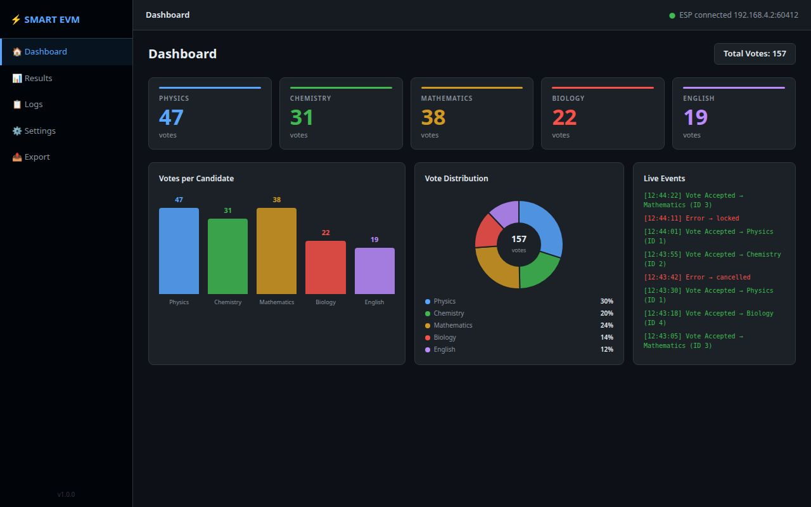
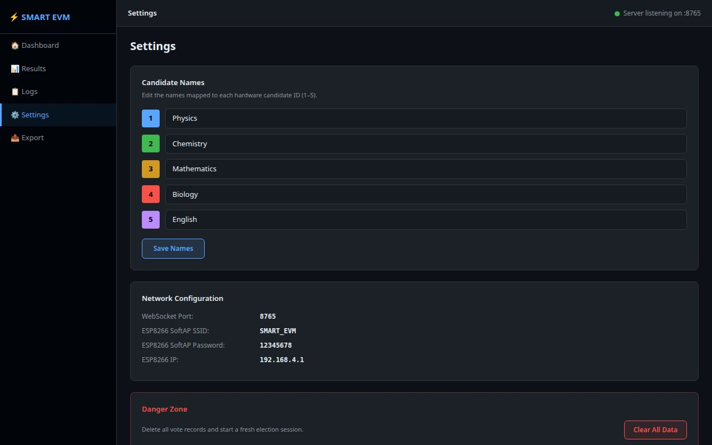

# ⚡ SMART EVM — Smart Electronic Voting Machine

🌐 **Website:** [smart-evm.lovable.app](https://smart-evm.lovable.app/)

> Made by **Ayush Raj, 8-ICSE**

A complete electronic voting system built with an **ESP8266 microcontroller** and a **Windows desktop application**. Voters hold a push button for **2 continuous seconds** to cast their vote. The desktop app receives every vote instantly over Wi-Fi, counts it, updates live charts, shows a real-time lockout countdown, and can export results to Excel.

---

## ✅ ESP8266 Firmware Compatibility 

**The firmware in this repo is 100% compatible with the desktop app.**

| Packet sent by ESP8266 | When it is sent | App handles it |
|---|---|---|
| `{"type":"vote","candidate_id":X}` | Button held for 2 full seconds | ✅ Saves vote, updates charts |
| `{"type":"error","reason":"false_vote_during_lockout"}` | Button pressed during 10 s lockout | ✅ Logged as error in red |
| `{"type":"hold_start","candidate_id":X}` | Button press first detected | ✅ Shows hold-progress bar |
| `{"type":"hold_cancel","candidate_id":X}` | Button released before 2 s | ✅ Hides hold-progress bar |
| Connects to **port 8765** | On WebSocket connect | ✅ Server listens on port 8765 |
| Connects to IP **192.168.4.2** | On WebSocket connect | ✅ PC gets this IP from ESP hotspot |

> **How the IP works:** The ESP8266 creates a Wi-Fi hotspot and acts as a router at `192.168.4.1`. When your PC connects to that hotspot, the ESP's built-in DHCP server automatically assigns the PC the IP `192.168.4.2`. The ESP then connects **to the PC** as a WebSocket client — the PC app is the server. No configuration needed.

---

## 📋 Table of Contents

1. [What You Need](#what-you-need)
2. [How the System Works](#how-the-system-works)
3. [Voting Logic — Full Detail](#voting-logic--full-detail)
4. [Part 1 — Upload Firmware to ESP8266](#part-1--upload-firmware-to-esp8266)
5. [Part 2 — Install the Desktop App](#part-2--install-the-desktop-app)
6. [Part 3 — Run Your First Election](#part-3--run-your-first-election)
7. [App Pages — Full Guide](#app-pages--full-guide)
8. [Wiring Guide](#wiring-guide)
9. [Troubleshooting](#troubleshooting)
10. [Project File Structure](#project-file-structure)
11. [Tech Stack](#tech-stack)

---

## What You Need

### Hardware
- NodeMCU ESP8266 board
- 5 × Push buttons (momentary, normally open)
- 1 × Blue LED + 220Ω resistor
- 1 × Active buzzer
- Jumper wires, breadboard, USB-A to Micro-USB cable

### Software (Windows PC)
- **Python 3.11 or newer** — [python.org/downloads](https://www.python.org/downloads/)
  > ⚠️ During installation, **check "Add Python to PATH"** before clicking Install
- **Arduino IDE 2.x** — [arduino.cc/en/software](https://www.arduino.cc/en/software)

---

## How the System Works

```
  Voter presses and HOLDS a push button
               │
               ▼
     ESP8266 detects press → sends hold_start packet
     PC Dashboard shows live hold-progress bar (0 → 100% over 2 s)
               │
               ▼
     If released before 2 s → vote cancelled, progress bar hides
               │
     If held for full 2 s:
               ▼
     ESP8266 sends vote packet ────────────► Desktop App on PC
               │                                    │
               ▼                                    ▼
     Two-beep confirmation                 Saves vote to SQLite database
     Blue LED flashes                      Updates live bar + pie charts
     10-second lockout starts              Hold-progress bar flashes 100%
               │                           Lockout countdown appears (10 s)
               ▼
     Any button press during lockout
     → 3-second alarm beep
     → Error packet sent to PC
     → Logged as "false vote" in red
```

**Who does what:**
- The **ESP8266** handles the physical side: buttons, blue LED, buzzer, and timing
- The **PC app** handles everything else: counting, storing, charts, results, Excel export
- They talk over **Wi-Fi** using WebSocket — no internet needed, it's a direct local link

---

## Voting Logic — Full Detail

### 1. Hold-to-Vote (2-second hold required)

A button press is **not** registered as a vote immediately. The voter must hold the button down for a **continuous 2 seconds**. If they release it before that, the vote is silently cancelled — nothing is sent to the PC.

This prevents accidental presses from being counted.

| Action | Result |
|---|---|
| Press and hold for 2 s | Vote confirmed ✅ |
| Press and release before 2 s | Cancelled — no vote sent |
| Press a second button while one is held | Second button ignored |

### 2. Vote Confirmation Feedback

When a vote is confirmed after 2 seconds:
- **ESP8266**: sends `{"type":"vote","candidate_id":X}` to the PC
- **ESP8266**: plays a **two-beep pattern** (300 ms on → 100 ms off → 300 ms on) — clearly audible
- **ESP8266**: flashes the **blue LED** for 700 ms
- **PC Dashboard**: hold-progress bar jumps to 100% then hides
- **PC Dashboard**: vote counter for that candidate increments immediately
- **PC Dashboard**: lockout countdown banner appears

### 3. 10-Second Lockout

After every confirmed vote, the machine enters a **10-second lockout**. No votes are accepted from any button during this period.

The **PC Dashboard** shows a live countdown banner with a draining red progress bar so the poll operator always knows exactly when the machine is ready again. The colour shifts to orange in the final 3 seconds.

### 4. False Vote Detection

If any button is pressed **during the 10-second lockout**:
- The vote is **not registered**
- The lockout timer is **not restarted**
- ESP8266 sends `{"type":"error","reason":"false_vote_during_lockout"}` to the PC
- ESP8266 plays a **3-second continuous alarm beep** + LED on for 3 s
- PC logs the attempt in red in the Live Events feed and the Logs page

### 5. Non-Blocking Design

All timing (hold countdown, lockout, beep patterns, LED) runs on `millis()`-based state machines in the ESP8266 firmware. No `delay()` is ever used inside `loop()`, so the WebSocket connection stays alive and responsive at all times.

---

## Part 1 — Upload Firmware to ESP8266

### Step 1 — Install Arduino IDE

Download and install from [arduino.cc/en/software](https://www.arduino.cc/en/software). Default settings are fine.

### Step 2 — Add ESP8266 board support

1. Open Arduino IDE → **File → Preferences**
2. Paste this into **"Additional boards manager URLs"**:
   ```
   https://arduino.esp8266.com/stable/package_esp8266com_index.json
   ```
3. Click **OK** → **Tools → Board → Boards Manager**
4. Search `esp8266` → Install **"ESP8266 by ESP8266 Community"**

### Step 3 — Install required library

Go to **Tools → Manage Libraries** and install:

| Search for | Install this |
|---|---|
| `WebSockets` | **WebSockets** by Markus Sattler |

> `ESP8266WiFi` is already included — you do not need to install it separately.
> `ArduinoJson` is **not** needed — the firmware builds its own JSON strings directly.

### Step 4 — Upload the sketch

1. Open `SMART_EVM.ino` in Arduino IDE
2. Connect ESP8266 to PC via USB
3. **Tools → Board** → select **NodeMCU 1.0 (ESP-12E Module)**
4. **Tools → Port** → select the COM port (e.g. `COM3`)
5. Click the **Upload** button (→ arrow icon)
6. Wait for **"Done uploading"**

### Step 5 — Verify

Open **Tools → Serial Monitor**, set baud to **115200**. On boot you should see:

```
=== SMART EVM — ESP8266 v1.4 ===
[WiFi] Access Point started
[WiFi] SSID     : SMART_EVM
[WiFi] Password : 12345678
[WiFi] AP IP    : 192.168.4.1
[WS] Connecting to ws://192.168.4.2:8765/ ...
```

The **buzzer beeps twice** (400 ms each) at boot as a hardware self-test. If you hear these beeps, the buzzer is wired correctly.

---

## Part 2 — Install the Desktop App

### Step 1 — Download the files

1. Go to the GitHub repository page
2. Click the green **Code** button → **Download ZIP**
3. Right-click the downloaded ZIP → **Extract All**
4. You will get a folder called `Smart_EVM` — keep all files inside it together

---

### Step 2 — Run SETUP.bat

> This is the **only step you ever need to do manually**. Everything else is automatic.

1. Open the `Smart_EVM` folder
2. **Double-click `SETUP.bat`**

A blue terminal window will open and work through these steps automatically:

```
Step 1 — Checks if Python is installed on your PC
         If NOT found → downloads Python 3.11 from python.org and installs silently

Step 2 — Creates a self-contained environment (.venv folder)
         Keeps SMART EVM's packages separate from anything else on your PC

Step 3 — Installs all required packages:
         PyQt6        (the app window and UI)
         websockets   (receives votes from ESP8266)
         matplotlib   (live bar and pie charts)
         openpyxl     (Excel export)
         qasync       (async bridge for Qt + WebSocket)
```

When it finishes you will see:

```
==========================================
  Setup complete!

  To launch the app:
    * Double-click  START.bat
    * Double-click  launch.vbs   (no CMD window)
    * Double-click  launch.pyw   (no CMD window)
==========================================
```

Press any key to close the setup window.

> **How long does it take?**
> About 1–3 minutes on first run depending on your internet speed.
> Every run after that is instant.

---

### Step 3 — Choose your launcher

#### Option A — `launch.vbs` ✅ Recommended for daily use

Double-click **`launch.vbs`**
- Opens the app with **zero CMD / terminal windows**
- Completely silent — nothing appears except the app itself

#### Option B — `launch.pyw`

Double-click **`launch.pyw`**
- Also opens with **no CMD window**
- Uses Python's built-in silent mode (`pythonw.exe`)

#### Option C — `START.bat`

Double-click **`START.bat`**
- A green terminal window appears briefly then closes once the app is open
- Good for the first launch or when you want to see startup messages

#### Option D — `launch.exe` (build it once, use forever)

1. Double-click **`make_exe.bat`** (after running SETUP.bat)
2. Wait 1–2 minutes — PyInstaller compiles the launcher
3. `launch.exe` appears in the folder — double-click to run with no CMD window

---

### Launcher comparison

| File | CMD window? | Requires setup first? | Notes |
|---|---|---|---|
| `SETUP.bat` | Yes (blue) | — | Run once to install everything |
| `START.bat` | Brief (green) | No — auto-installs if needed | Good for troubleshooting |
| `launch.vbs` | **None** | Yes — run SETUP.bat first | Best for daily use |
| `launch.pyw` | **None** | Yes — run SETUP.bat first | Alternative silent launcher |
| `launch.exe` | **None** | Run `make_exe.bat` once | Standalone executable |

**The correct order on a new PC:**
```
1. Double-click SETUP.bat    ← once only
2. Double-click launch.vbs   ← every time you want to open the app
```

---

## Part 3 — Run Your First Election

### 1. Power on the ESP8266
Connect it to USB. You will hear **two beeps** — this confirms the buzzer and board are working.

### 2. Connect PC to ESP8266 Wi-Fi
1. Click the Wi-Fi icon in the Windows taskbar
2. Find **`SMART_EVM`** → click **Connect**
3. Password: **`12345678`**

> ⚠️ Windows shows "No internet" — this is normal. It is a direct local link.

### 3. Launch the app
Double-click **`launch.vbs`** (or `START.bat`).

### 4. Confirm connection
Top-right of the app will change from:
```
● Server starting...
```
to:
```
● ESP connected  192.168.4.2:XXXXX
```
You will also hear **three quick beeps** from the ESP buzzer confirming the WebSocket connected.

### 5. Cast a vote

A voter presses and **holds** a button for **2 continuous seconds**:

| What you see / hear | Meaning |
|---|---|
| Hold-progress bar appears on dashboard | Button press detected, 2 s countdown in progress |
| Bar reaches 100% + two beeps + LED flash | Vote accepted and sent to PC |
| Progress bar hides, lockout banner appears | 10-second lockout begins |
| Countdown ticks from 10 s → 0 s (red → orange) | Lockout in progress |
| Banner shows "✅ Ready" then hides | Machine ready for next voter |
| 3-second continuous alarm + red LED | Button pressed during lockout — false vote detected |

### 6. End the session
- Go to **Export** tab → save results to Excel
- To reset for a new election: **Settings → Clear All Data**

---

## App Pages — Full Guide

### 🏠 Dashboard

The main screen. Updates in real time every time a vote arrives.



- **5 vote counter cards** — one per candidate with live totals
- **Hold-progress bar** *(new)* — appears when a button is held, animates from 0% → 100% over 2 s, then flashes green "Vote confirmed!" — gives the poll operator a live view of what's happening at the hardware
- **Lockout countdown banner** *(new)* — appears after every confirmed vote, counts down 10 → 0 seconds with a draining red progress bar; turns orange in the last 3 seconds; shows "✅ Ready" when the machine is open again
- **Bar chart** — side-by-side comparison of all candidates
- **Pie chart** — percentage share of each candidate
- **Live Events feed** — every vote (green) and false-vote error (red) logged as it happens
- **Total Votes** — running total in the top-right corner

---

### 📊 Results

Ranked table, sorted from highest to lowest votes.


- Each candidate shown with ID, name, votes, and percentage
- Coloured progress bar for each candidate
- Leading candidate highlighted with a green **LEADER** badge
- Click **Refresh** to manually reload

---

### 📋 Logs

Complete record of every event in the current session.


- Green **VOTE** badge for accepted votes
- Red badge for errors
- Exact timestamp for every entry
- Filter dropdown: All Events / Votes Only / Errors Only

| Error type shown | Meaning |
|---|---|
| `false_vote_during_lockout` | Button pressed during the 10-second lockout period |

---

### ⚙️ Settings

Configure the system before an election.



**Candidate Names** — Give each button a real name. Button 1 could be "Rahul Sharma" instead of "Physics". Click **Save Names** after editing.

**Display** — Switch between full screen and windowed mode:
- Click **Enter Full Screen** to make the app fill the entire monitor
- Click **Exit Full Screen** to return to a normal window
- Press the **Esc** key to exit full screen at any time

**Network Configuration** — Shows connection details for reference.

**Clear All Data** — Deletes all votes and resets all counters. Use at the start of each new election.

---

### 📤 Export

Save results to an Excel file.


The Excel file contains:
- **Summary Sheet** — vote totals per candidate
- **Bar Chart** — automatically generated comparison chart
- **Pie Chart** — percentage distribution chart
- **Event Log Sheet** — every vote with its exact timestamp

How to export: Click **Browse…** to choose a save location → click **Export to Excel**.

---

### 🔧 Debugging Log

This page shows everything the app is doing internally — what previously appeared in a CMD/terminal window.

- **Blue entries** = INFO messages (normal operation)
- **Orange entries** = WARNINGS (e.g. ESP disconnected)
- **Red entries** = ERRORS (something went wrong)
- **Grey entries** = DEBUG messages

Use this page to diagnose any issues without ever opening a terminal.

---

## Wiring Guide

### Push Buttons → ESP8266

Each button connects between the ESP8266 pin and **GND**. The internal pull-up resistor is used — no external resistors needed for the buttons.

| Button | ESP8266 Pin | Candidate slot |
|---|---|---|
| Button 1 | **D1** (GPIO5) | Candidate 1 |
| Button 2 | **D2** (GPIO4) | Candidate 2 |
| Button 3 | **D5** (GPIO14) | Candidate 3 |
| Button 4 | **D6** (GPIO12) | Candidate 4 |
| Button 5 | **D7** (GPIO13) | Candidate 5 |

```
ESP8266 Pin (D1/D2/D5/D6/D7)  ──┤ Button ├──  GND
```

### Blue LED → ESP8266

| Component | ESP8266 Pin |
|---|---|
| Blue LED (+) via 220Ω resistor | **D4** (GPIO2) |
| Blue LED (–) | GND |

```
D4  ──  [220Ω]  ──  [LED +]  ──  [LED –]  ──  GND
```

### Buzzer → ESP8266

| Component | ESP8266 Pin |
|---|---|
| Buzzer (+) | **D8** (GPIO15) |
| Buzzer (–) | GND |

> ⚠️ **GPIO15 note:** D8 (GPIO15) has an onboard 10 kΩ pull-down resistor on the NodeMCU. Most active buzzers work fine when wired directly. If your buzzer is silent:
> 1. **Try swapping the + and − legs** — some buzzer modules have reversed markings
> 2. **For reliable drive**, wire a transistor between the ESP and buzzer:
>    ```
>    D8 → [1 kΩ] → NPN Base (e.g. 2N2222 / BC547)
>    Collector → Buzzer (+)
>    Buzzer (−) → GND
>    Emitter → GND
>    3.3V → Buzzer (+) power rail
>    ```

### Full Wiring Summary

```
ESP8266 NodeMCU
│
├── D1  →  Button 1 → GND   (Candidate 1)
├── D2  →  Button 2 → GND   (Candidate 2)
├── D5  →  Button 3 → GND   (Candidate 3)
├── D6  →  Button 4 → GND   (Candidate 4)
├── D7  →  Button 5 → GND   (Candidate 5)
│
├── D4  →  220Ω → Blue LED (+) → Blue LED (–) → GND
├── D8  →  Buzzer (+)  |  Buzzer (–) → GND
│
├── 3.3V / GND  →  Common power rail
└── USB  →  PC for uploading firmware
```

> ⚠️ **Power tip:** Add a 470 µF capacitor between 3.3V and GND near the ESP8266 to prevent resets when the Wi-Fi radio activates.

---

## Troubleshooting

### Buzzer not making any sound

1. **Check the boot beeps** — on power-on the firmware plays two 400 ms beeps as a hardware self-test. If you hear those, the hardware is fine and the issue is elsewhere. If you hear nothing at all, the wiring is wrong.
2. **Swap + and −** — some active buzzer modules have reversed markings.
3. **GPIO15 pull-down** — if direct wiring still doesn't work, use a transistor as shown in the Wiring Guide above.
4. **Confirm it's an active buzzer** — active buzzers work with a plain HIGH/LOW signal. Passive buzzers need a PWM frequency and will not work with this firmware.

### App never shows "ESP connected"

- Make sure PC Wi-Fi is connected to **SMART_EVM**
- Make sure the ESP8266 is powered on
- If Windows Firewall shows a prompt → click **Allow access**
- Check the **Debugging Log** page inside the app for detailed error messages

### Vote not registering after holding a button

Open **Tools → Serial Monitor** (baud: 115200). When a button is held for 2 seconds you should see:

```
[BTN] Candidate 1 hold started — hold for 2 s to vote
[BTN] Candidate 1 vote CONFIRMED (held 2 s)
[TX] {"type":"vote","candidate_id":1}
```

If you see `[WS] Disconnected`, run `ipconfig` in Command Prompt and check the IP of the SMART_EVM adapter. If it is not `192.168.4.2`, update this line in the firmware and re-upload:

```cpp
const char* WS_HOST = "192.168.4.2";
```

### Hold-progress bar not appearing on the dashboard

The progress bar is driven by `hold_start` packets from the ESP. If it never appears, check the **Debugging Log** page — if you see `[TX] {"type":"hold_start",...}` in the Serial Monitor but nothing on the PC, there may be a WebSocket connection issue.

### Button seems to trigger during lockout

This is expected behaviour — pressing during lockout fires the **false vote detection**: a 3-second alarm beep and an error packet. The lockout timer is not restarted. Wait for the countdown to reach 0.

### START.bat shows "Python not found"

Run **SETUP.bat** — it detects missing Python and installs it automatically.

### App closes immediately

Open the **Debugging Log** page if the app opens at all. Otherwise open Command Prompt, go to the `Smart_EVM` folder, and run:
```
python main.py
```
The full error will be printed there.

### How to build launch.exe

1. Run **SETUP.bat** first
2. Double-click **make_exe.bat**
3. `launch.exe` will appear in the folder
4. Double-click it — no CMD window, no setup needed

---

## Project File Structure

```
Smart_EVM/
│
├── SMART_EVM.ino      ← ESP8266 firmware (upload this to the board)
│
├── START.bat          ← Launch app (green CMD window, closes itself)
├── SETUP.bat          ← First-time setup / auto-installs Python
├── launch.vbs         ← Launch silently — no CMD window (recommended)
├── launch.pyw         ← Launch silently via pythonw — no CMD window
├── make_exe.bat       ← Builds launch.exe using PyInstaller (run once)
├── requirements.txt   ← Python package list
│
├── main.py            ← App entry point + main window
├── websocket_server.py← Receives all ESP packets (vote, error, hold_start, hold_cancel)
├── database.py        ← Saves and reads votes (SQLite)
├── excel_export.py    ← Generates Excel report
├── charts.py          ← Live bar and pie chart widgets
├── config.py          ← All settings (colours, candidate names, ports, paths)
├── logger.py          ← Logging (output shown in Debugging Log page)
│
├── ui/
│   ├── dashboard.py   ← Dashboard (vote cards, hold-progress bar, lockout timer, charts)
│   ├── results_page.py← Ranked results table
│   ├── logs_page.py   ← Event log viewer with filter
│   ├── settings_page.py← Candidate names, full screen, clear data
│   ├── export_page.py ← Excel export
│   └── debug_page.py  ← Debugging Log (replaces CMD window)
│
├── database/
│   └── evm.db         ← Vote database (auto-created on first run)
├── exports/
│   └── results.xlsx   ← Default Excel export location
└── assets/            ← Screenshots used in this README
```

---

## Tech Stack

| Component | Technology |
|---|---|
| Desktop GUI | Python 3.11+ + PyQt6 |
| Real-time communication | WebSockets (asyncio + qasync) |
| Vote database | SQLite (built into Python) |
| Live charts | Matplotlib |
| Excel export | openpyxl |
| Microcontroller | ESP8266 NodeMCU |
| Input | Momentary push buttons (hold-to-vote, 2 s) |
| Feedback | Blue LED + active buzzer (non-blocking sequencer) |
| Firmware language | C++ (Arduino framework, no delay() in loop) |

---

## Changelog

### v1.4 (current)
- **Hold-to-vote:** button must be held for **2 continuous seconds** to register a vote (was instant press in original)
- **10-second lockout:** extended from 2 s to 10 s after each confirmed vote
- **False vote detection:** any button press during lockout triggers a 3-second alarm beep and sends an error packet to the PC
- **Non-blocking beep sequencer:** firmware plays patterns (double-beep on confirm, 3 s alarm on false vote) using a `millis()`-based state machine — no `delay()` in `loop()`
- **Boot self-test:** two 400 ms beeps on power-on confirm the buzzer is working
- **Hold-start / hold-cancel packets:** ESP sends `hold_start` when a button is pressed and `hold_cancel` if released early — enables the PC dashboard to show live progress
- **Dashboard — hold-progress bar:** animated 0→100% bar appears while a button is held, flashes green "Vote confirmed!" on success
- **Dashboard — lockout countdown timer:** red draining bar counts down 10→0 s after every vote; turns orange in the last 3 s; shows "✅ Ready" when the machine reopens

---

*Built as a complete IoT voting system for classroom and small-scale elections.*
*Made by **Ayush Raj, 8-ICSE***
